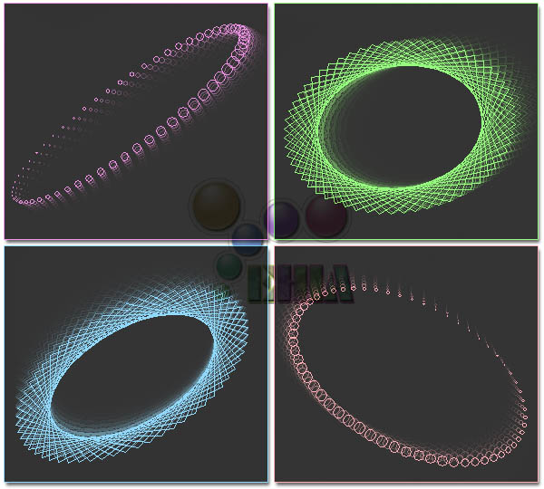



## A  3D Motion Screen Saver \( AMAZING \.\.\. No DirectX \!\!\! \) \[Updated\]

### Description

If you want to be amazed, then take a look at this screen saver, but my advice to you before you run the code, "don't spend more than one hour staring at the motion." looool ;). Start learning the code. This is a very wonderful graphical program that I'll update later on as a complete screen saver. In this screen saver, there is a number of circles (or lines) froming an object that rotates and moves in a fasinating 3D-motion. Also, there are colors rotation and fading effect. You can change the settings and get different styles of motion. You can also add some changes to the code. Change speeds, sizes, colors, number of circles, ranges of randome numbers, timers intervals, and enjoy... I hope you will like this program ... Comments and votes will be well appreciated ...
 
### More Info
 

             |
---                |---
**Submitted On**   |2004-03-02 19:28:14
**By**             |[Yehia Muhsen](https://github.com/Planet-Source-Code/PSCIndex/blob/master/ByAuthor/yehia-muhsen.md)
**Level**          |Intermediate
**User Rating**    |5.0 (699 globes from 141 users)
**Compatibility**  |VB 5\.0, VB 6\.0
**Category**       |[Graphics](https://github.com/Planet-Source-Code/PSCIndex/blob/master/ByCategory/graphics__1-46.md)
**World**          |[Visual Basic](https://github.com/Planet-Source-Code/PSCIndex/blob/master/ByWorld/visual-basic.md)
**Archive File**   |[A\_\_3D\_Moti171536322004\.zip](https://github.com/Planet-Source-Code/yehia-muhsen-a-3d-motion-screen-saver-amazing-no-directx-updated__1-48190/archive/master.zip)

